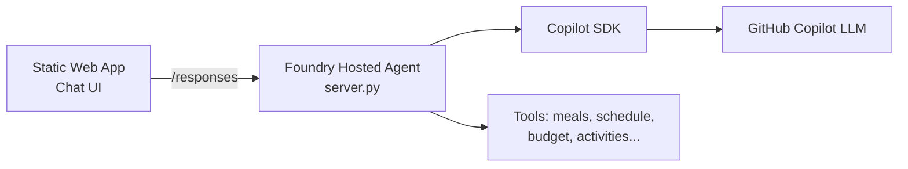

# Millennial Mum 🍼💼

The ultimate AI copilot for working parents juggling careers and small children.

Built with the [GitHub Copilot Python SDK](https://github.com/github/copilot-sdk), hosted on [Azure AI Foundry](https://learn.microsoft.com/azure/ai-foundry/) with a [Static Web App](https://learn.microsoft.com/azure/static-web-apps/) frontend.

## Features

- 🍱 **Meal Planner** — Quick healthy kid-friendly meals from what you have
- 📅 **Schedule Manager** — Juggle childcare, school runs, work, appointments
- 🎨 **Activity Finder** — Age-appropriate activities for available time/weather
- 💰 **Budget Helper** — Track family spend, find savings
- 📝 **Admin Autopilot** — Draft school emails, absence notes, appointment reminders
- 🛒 **Shopping List** — Running list that captures items as mentioned
- 🚨 **Emergency Quick-Ref** — NHS-sourced guidance for toddler health concerns
- 🧠 **Family Memory** — Remembers your family details across sessions

## Prerequisites

- Python 3.11+
- GitHub Copilot CLI installed (`gh copilot` or standalone)
- `gh auth login` + `gh auth refresh --scopes copilot`

## Setup

```bash
cd millennial-mum
python -m venv .venv
.venv\Scripts\activate      # Windows
# source .venv/bin/activate  # Mac/Linux
pip install -r requirements.txt
```

## CLI Mode (Original)

You can still run the agent locally as a CLI chat:

```bash
python app.py
```

## Architecture



```
millennial-mum/
├── app.py                  # CLI entry point (local interactive chat)
├── server.py               # Foundry hosted agent server (responses protocol)
├── agent_config.py         # System prompt & agent personality
├── agent.yaml              # Foundry agent deployment config
├── Dockerfile              # Container image for Foundry hosting
├── requirements.txt        # CLI dependencies
├── requirements-hosted.txt # Server dependencies
├── tools/
│   ├── __init__.py
│   ├── meal_planner.py     # Meal suggestions & grocery lists
│   ├── schedule.py         # Calendar & reminder management
│   ├── activities.py       # Activity finder by age/time/weather
│   ├── budget.py           # Family budget tracking
│   ├── admin.py            # Email drafts, forms, notes
│   ├── shopping_list.py    # Shopping list management
│   ├── emergency.py        # NHS emergency quick-ref
│   └── memory.py           # Family profile memory
├── frontend/               # Web UI (Azure Static Web Apps)
│   ├── index.html          # Chat interface
│   ├── styles.css          # Styling
│   └── app.js              # Frontend logic
├── staticwebapp.config.json # SWA routing config
└── swa-cli.config.json     # SWA CLI dev config
```

## Step 1: Deploy Agent to Foundry

The agent runs as a hosted container in Azure AI Foundry.

### Local Testing

```bash
cd millennial-mum
python -m venv .venv
.venv\Scripts\activate
pip install -r requirements-hosted.txt

# Create .env with your GITHUB_TOKEN
cp .env.example .env
# Edit .env and add your token

python server.py
# Agent starts on http://localhost:8088
```

Test with curl:
```bash
curl -X POST http://localhost:8088/responses \
  -H "Content-Type: application/json" \
  -d '{"input": [{"role": "user", "content": "What can I make with pasta and cheese?"}]}'
```

### Deploy to Foundry

Once local testing works, deploy to Foundry:
```bash
# Build container (must be linux/amd64)
docker build --platform linux/amd64 -t millennial-mum .

# Then use: deploy agent to foundry
```

## Step 2: Web UI (Azure Static Web Apps)

The frontend calls the Foundry agent directly — no backend proxy needed.

### Local Development

```bash
npm install -g @azure/static-web-apps-cli
swa start
```

The UI defaults to `http://localhost:8088` for the agent endpoint (set in `app.js`).

### Deploy to Azure

```bash
az staticwebapp create \
  --name millennial-mum \
  --resource-group <your-rg> \
  --location "West Europe" \
  --sku Free

# Deploy
swa deploy \
  --app-location frontend \
  --deployment-token <your-token>
```

Update `AGENT_ENDPOINT` in `frontend/app.js` to your Foundry agent URL before deploying.

Once running locally, this agent can be wrapped with the Microsoft Agent Framework
hosting adapter and deployed to Microsoft Foundry as a hosted agent with:
- Hosted models (GPT-4o, GPT-5)
- Foundry Toolbox (web search, AI search, etc.)
- Production eval & tracing
