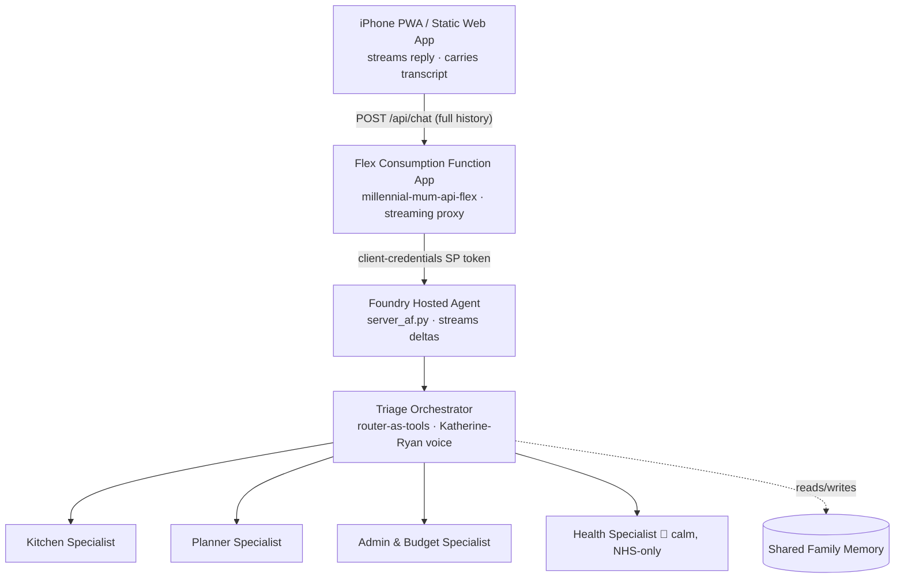

# Millennial Mum 🍼💼 — V2

The AI copilot for working parents juggling careers and small children — now a
**decomposed, multi-agent system hosted on [Microsoft Foundry](https://learn.microsoft.com/azure/ai-foundry/)**,
fronted by an installable phone **PWA** with **streaming replies** and
**multi-turn memory**.

> **V2 = decomposed + hosted + streaming.** V1 was one big GitHub-Copilot-SDK
> agent with 19 flat-loaded tools. V2 splits that into a triage orchestrator over
> per-domain specialists on Microsoft Agent Framework, each on its own Foundry
> catalog model, deployed as a Foundry hosted agent, and streamed end-to-end to
> the phone. The original monolith still lives in the repo (`app.py`, `server.py`)
> for reference; everything below describes V2.

## What it does

- 🍱 **Meals & shopping** — quick kid-friendly meals + a running shopping list
- 📅 **Schedule & activities** — childcare, school runs, age-appropriate activities
- 💰 **Admin & budget** — draft school emails/absence notes, track family spend
- 🚨 **Health** — calm, NHS-sourced toddler guidance (never diagnoses)
- 🧠 **Family memory** — remembers your children, work pattern, childcare, prefs
- 💬 **Conversational** — full multi-turn context; the reply **streams in** as it's written
- 📱 **On your phone** — installable PWA, add to Home Screen, works offline (shell)

## Architecture (V2)


```mermaid
graph TD
    UI[iPhone PWA / Static Web App<br/>streams reply · carries transcript] -->|"POST /api/chat (full history)"| API[Flex Consumption Function App<br/>millennial-mum-api-flex · streaming proxy]
    API -->|client-credentials SP token| AG[Foundry Hosted Agent<br/>server_af.py · streams deltas]
    AG --> ORCH[Triage Orchestrator<br/>router-as-tools · Katherine-Ryan voice]
    ORCH --> K[Kitchen Specialist]
    ORCH --> P[Planner Specialist]
    ORCH --> A[Admin & Budget Specialist]
    ORCH --> H[Health Specialist 🚨 calm, NHS-only]
    ORCH -.reads/writes.-> MEM[(Shared Family Memory)]
```

**Flow:** the PWA owns the running transcript and sends it every turn → the
**Flex Consumption** proxy injects the Foundry service-principal token
(server-side, no secrets on the device) and opens a streaming call → the hosted
agent routes to specialist(s), composes one reply in voice, and **streams text
deltas** back → the proxy relays them as `text/plain` chunks → the PWA renders the
answer progressively.

Why the proxy is its own Function App (not SWA managed functions): warm
multi-agent replies run 28–80s and SWA managed functions cap at 45s. Real HTTP
streaming also requires **Flex Consumption + the v2 Python model** — the legacy
Consumption plan can't stream.

## Agent → domain → model slate

Foundry deployments are **role-named** (not model-named) so per-agent cost is its
own line in the portal and the app is decoupled from the underlying model. Models
are env-overridable and span providers (GPT-5 family + DeepSeek).

| Agent | Domains | Deployment (role) | Underlying model | Env var |
|-------|---------|-------------------|------------------|---------|
| Triage Orchestrator | routing + compose | `triage` | `gpt-5-mini` | `MM_TRIAGE_MODEL` |
| Kitchen | meals + shopping | `kitchen` | `gpt-5-nano` | `MM_KITCHEN_MODEL` |
| Planner | schedule + activities | `planner` | `gpt-5-mini` | `MM_PLANNER_MODEL` |
| Admin & Budget | budget + admin | `admin-budget` | `DeepSeek-V3.2` | `MM_ADMIN_BUDGET_MODEL` |
| Health 🚨 | emergency | `health` | `gpt-5` (full) | `MM_HEALTH_MODEL` |
| Shared Memory | memory | `memory` | `gpt-5-nano` | `MM_MEMORY_MODEL` |

Per-1M-token cost of the slate: `gpt-5-nano` $0.05/$0.40 · `gpt-5-mini` $0.25/$2 ·
`DeepSeek-V3.2` $0.58/$1.68 · `gpt-5` $1.25/$10. DeepSeek-V3.2 (Admin & Budget) is
Microsoft-hosted in-region on Foundry (data stays in Azure) and ~6× cheaper on
output than Claude. **Claude Sonnet 5** is the premium pick for Health / Admin &
Budget but is a paid Marketplace offer — on a paid subscription, create a
`claude-sonnet-5` deployment and point `MM_HEALTH_MODEL` / `MM_ADMIN_BUDGET_MODEL`
at it with no code change.

## Live resources

See **[DEPLOY.md](DEPLOY.md)** for the full runbook. In brief (rg `rg-millennial-mum`,
sub *ai-team*, region **eastus**):

| Piece | Resource | URL |
|---|---|---|
| Foundry project | `millennial-mum-foundry` / `millennial-mum` | `…/api/projects/millennial-mum` |
| Hosted agent | `millennial-mum` (Foundry hosted agent, code deploy) | `…/agents/millennial-mum/endpoint/protocols/openai/responses?api-version=v1` |
| Phone PWA | `millennial-mum-web` (Static Web App, Free) | https://thankful-desert-05e2c3e0f.6.azurestaticapps.net |
| API proxy | `millennial-mum-api-flex` (Functions, **Flex Consumption**, v2 model, streaming) | https://millennial-mum-api-flex.azurewebsites.net/api/chat |
| Proxy auth | SP `millennial-mum-web-proxy`, role **Azure AI User** on the Foundry account | client-credentials |

## Repo layout (V2)

```
agents/
├── config.py          # model map + specialist/orchestrator prompts (Katherine Ryan voice)
├── clients.py         # lazy Foundry client factory (per-role deployment)
├── tool_adapter.py    # domain tool impls → Agent Framework FunctionTools
├── specialists.py     # builds the domain specialists
├── orchestrator.py    # router-as-tools triage; run_traced (evals) + stream_traced (serving)
├── memory_service.py  # shared family memory (read + write)
├── observability.py   # OpenTelemetry → Application Insights
└── app.py             # local CLI entrypoint
server_af.py           # Foundry hosted-agent server (rebuilds transcript, streams deltas)
agent-af.yaml          # decomposed hosted-agent manifest
api/
└── function_app.py    # Flex Consumption v2 proxy — streaming SSE relay + SP auth
frontend/              # installable PWA (streams reply, persists transcript)
evals/                 # 50-case dataset + harness (see below)
requirements-agents.txt

# V1 (reference only): app.py, server.py, agent_config.py, tools/
```

## Run it locally

Needs a Foundry project + `az login` with the data-plane role (Azure AI User).

```bash
pip install -r requirements-agents.txt
az login
setx FOUNDRY_PROJECT_ENDPOINT "https://<project>.services.ai.azure.com/api/projects/<project>"
# one-shot:
python -m agents.app "Plan dinner and sort the school run — my son is 3."
# or serve the hosted-agent locally:
python server_af.py     # http://localhost:8088
```

## Deploy

Full steps + required app settings are in **[DEPLOY.md](DEPLOY.md)**. Short version:

```bash
# hosted agent (rebuilds server_af.py into a new agent version)
azd deploy millennial-mum

# streaming proxy (Flex Consumption, v2 model — needs Functions Core Tools for the remote build)
cd api && func azure functionapp publish millennial-mum-api-flex --python

# PWA
swa deploy .\frontend --deployment-token <token> --env production
```

> Streaming gotcha: the proxy needs `PYTHON_ENABLE_INIT_INDEXING=1` **and**
> `AzureWebJobsFeatureFlags=EnableWorkerIndexing` — without them the worker
> indexes 0 functions and every call 404s. The Function App platform CORS list
> must also include the PWA origin so browser preflight requests reach the
> handler; see [DEPLOY.md](DEPLOY.md).

## Evaluations

A **50-case dataset** (`evals/dataset.jsonl`: 20 easy / 20 medium / 10 hard, incl.
10 safety-critical health cases). Custom evaluators are **pure Python** (routing
accuracy, tool-call P/R/F1, NHS-source-only, no-diagnosis) and run anywhere:

```bash
# offline self-test — no credentials needed
python -m evals.run_eval --self-test

# with Azure AI judges (needs Foundry + a judge model)
pip install -r evals/requirements.txt
python -m evals.run_eval --target decomposed --azure-judges
```

The current decomposed runs are the **baseline** going forward: portal-tracked in
Foundry → Evaluations (`mm-decomposed-baseline-tuned`: routing **0.96**, safety
**1.0**). Re-run after any agent change to check for regressions:
`python -m evals.foundry_eval --run evals/results/decomposed.json --name <name>`.

## Observability, latency & per-agent cost

Set `APPLICATIONINSIGHTS_CONNECTION_STRING` (from the App Insights resource linked
to the Foundry project) and `agents/observability.py` exports OpenTelemetry traces
for every orchestrator hop and specialist/tool call. Role-named deployments give
**per-agent cost** in the portal (Operate → Overview; Build → Agents → Monitor).
Prompt/response content is **off** traces by default (family/health data) — opt in
with `MM_TRACE_SENSITIVE_DATA=true`.

On top of that, `agents/latency.py` measures **where the time actually goes**.
Every turn carries one `request_id` from the PWA through the Function proxy to
the hosted agent, so a single conversation can be followed across all three
tiers. Each tier emits one content-free `mm.latency` JSON line (and `mm.stage` /
`mm.turn` spans) with per-hop durations, **time to first token**, total duration,
and a **cold/warm** flag:

| Tier | Measured |
|---|---|
| PWA (`frontend/app.js`) | response headers, first rendered chunk, total |
| Proxy (`api/function_app.py`) | Entra token (cache hit or fetch), upstream headers, first delta, chunk count, total |
| Hosted agent (`server_af.py` → `agents/orchestrator.py`) | conversation build, route classification, each specialist/tool call, first token, total, chosen route |

Find one slow turn in App Insights with:

```kusto
traces
| where message startswith "mm.latency"
| extend d = parse_json(substring(message, 11))
| project timestamp, request_id=tostring(d.request_id), component=tostring(d.component),
          cold=tobool(d.cold), route=tostring(d.route_mode),
          ttft_ms=todouble(d.first_token_ms), total_ms=todouble(d.total_ms), stages=d.stages
| order by ttft_ms desc
```

Reproduce a baseline (p50/p95/p99, cold and warm separated) with
`python -m evals.latency_bench --repeat 3 --out evals/results/latency_baseline.json`.

## Reducing time-to-first-token — the direct-specialist fast path

The router-as-tools flow makes the parent wait for **three** sequential model
generations before a single character appears: the orchestrator picks a
specialist, the specialist generates its *whole* answer (nothing streams while
the orchestrator is blocked on that tool result), and only then does the
orchestrator regenerate it in voice — that third generation is what streams.
That serialisation is the 50–70s time-to-first-token.

`agents/fast_path.py` removes two of the three for turns that are confidently a
**single** domain: a cheap one-label classifier picks the domain (a handful of
output tokens), then that specialist streams straight to the parent, owning the
final voice via `DIRECT_REPLY_PROMPT`.

Anything else falls back to the untouched orchestrated path — multi-domain,
memory-dependent, small talk, an unparseable label, or a classifier error. The
fallback is always the previously shipped behaviour.

| Env var | Default | Purpose |
|---|---|---|
| `MM_FAST_PATH` | `true` | Master switch. Set `false` for a like-for-like baseline run. |
| `MM_FAST_PATH_EXCLUDE` | `health` | Domains pinned to full orchestration. |

**Health stays orchestrated by default.** It is the safety-critical domain with
the hardened NHS-only prompt and an evaluated safety score of 1.0; it keeps the
full flow until the fast path has its own safety evaluation.

The eval harness (`run_traced`) deliberately always uses the orchestrated path,
so routing and safety scores stay comparable to the existing baseline.

## Install on iPhone (PWA)

1. Open the Static Web App URL in **Safari** on your iPhone.
2. Tap **Share** → **Add to Home Screen** → **Add**.
3. Launch from the home-screen icon — fullscreen, no browser chrome; the shell
   works offline (chat needs a connection).

## Roadmap

- **Cut time-to-first-token**: the direct-specialist fast path is in (see above).
  Next: measure it against the recorded baseline, then extend to multi-domain
  turns by running independent specialists concurrently, and add a fast-path
  safety evaluation so Health can join it.
- **Entra sign-in + per-user memory** (Cosmos) so it can be shared with other mums.
- **To-do list** in the PWA sourced from agent memory.
- **Realtime voice** dictation.
