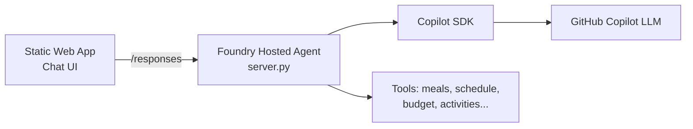
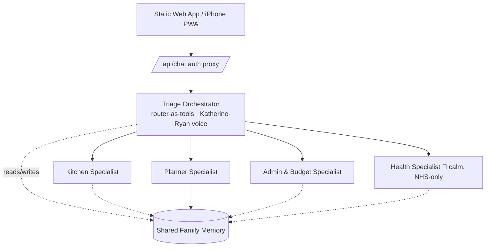

# Millennial Mum 🍼💼

The ultimate AI copilot for working parents juggling careers and small children.

Built with the [GitHub Copilot Python SDK](https://github.com/github/copilot-sdk), hosted on [Azure AI Foundry](https://learn.microsoft.com/azure/ai-foundry/) with a [Static Web App](https://learn.microsoft.com/azure/static-web-apps/) frontend.

## Features

- 🍱 **Meal Planner** — Quick healthy kid-friendly meals from what you have
- 📅 **Schedule Manager** — Juggle childcare, school runs, work, appointments
- 🎨 **Activity Finder** — Age-appropriate activities for available time/weather
- 💰 **Budget Helper** — Track family spend, find savings
- 📝 **Admin Autopilot** — Draft school emails, absence notes, appointment reminders
- 🛒 **Shopping List** — Running list that captures items as mentioned
- 🚨 **Emergency Quick-Ref** — NHS-sourced guidance for toddler health concerns
- 🧠 **Family Memory** — Remembers your family details across sessions

## Prerequisites

- Python 3.11+
- GitHub Copilot CLI installed (`gh copilot` or standalone)
- `gh auth login` + `gh auth refresh --scopes copilot`

## Setup

```bash
cd millennial-mum
python -m venv .venv
.venv\Scripts\activate      # Windows
# source .venv/bin/activate  # Mac/Linux
pip install -r requirements.txt
```

## CLI Mode (Original)

You can still run the agent locally as a CLI chat:

```bash
python app.py
```

## Architecture


```mermaid
graph LR
    A[Static Web App<br/>Chat UI] -->|/responses| B[Foundry Hosted Agent<br/>server.py]
    B --> C[Copilot SDK]
    C --> D[GitHub Copilot LLM]
    B --> E[Tools: meals, schedule,<br/>budget, activities...]
```

```
millennial-mum/
├── app.py                  # CLI entry point (local interactive chat)
├── server.py               # Foundry hosted agent server (responses protocol)
├── agent_config.py         # System prompt & agent personality
├── agent.yaml              # Foundry agent deployment config
├── Dockerfile              # Container image for Foundry hosting
├── requirements.txt        # CLI dependencies
├── requirements-hosted.txt # Server dependencies
├── tools/
│   ├── __init__.py
│   ├── meal_planner.py     # Meal suggestions & grocery lists
│   ├── schedule.py         # Calendar & reminder management
│   ├── activities.py       # Activity finder by age/time/weather
│   ├── budget.py           # Family budget tracking
│   ├── admin.py            # Email drafts, forms, notes
│   ├── shopping_list.py    # Shopping list management
│   ├── emergency.py        # NHS emergency quick-ref
│   └── memory.py           # Family profile memory
├── frontend/               # Web UI (Azure Static Web Apps)
│   ├── index.html          # Chat interface
│   ├── styles.css          # Styling
│   └── app.js              # Frontend logic
├── staticwebapp.config.json # SWA routing config
└── swa-cli.config.json     # SWA CLI dev config
```

## Step 1: Deploy Agent to Foundry

The agent runs as a hosted container in Azure AI Foundry.

### Local Testing

```bash
cd millennial-mum
python -m venv .venv
.venv\Scripts\activate
pip install -r requirements-hosted.txt

# Create .env with your GITHUB_TOKEN
cp .env.example .env
# Edit .env and add your token

python server.py
# Agent starts on http://localhost:8088
```

Test with curl:
```bash
curl -X POST http://localhost:8088/responses \
  -H "Content-Type: application/json" \
  -d '{"input": [{"role": "user", "content": "What can I make with pasta and cheese?"}]}'
```

### Deploy to Foundry

Once local testing works, deploy to Foundry:
```bash
# Build container (must be linux/amd64)
docker build --platform linux/amd64 -t millennial-mum .

# Then use: deploy agent to foundry
```

## Step 2: Web UI (Azure Static Web Apps)

The frontend calls the Foundry agent directly — no backend proxy needed.

### Local Development

```bash
npm install -g @azure/static-web-apps-cli
swa start
```

The UI defaults to `http://localhost:8088` for the agent endpoint (set in `app.js`).

### Deploy to Azure

```bash
az staticwebapp create \
  --name millennial-mum \
  --resource-group <your-rg> \
  --location "West Europe" \
  --sku Free

# Deploy
swa deploy \
  --app-location frontend \
  --deployment-token <your-token>
```

Update `AGENT_ENDPOINT` in `frontend/app.js` to your Foundry agent URL before deploying.

Once running locally, this agent can be wrapped with the Microsoft Agent Framework
hosting adapter and deployed to Microsoft Foundry as a hosted agent with:
- Hosted models (GPT-4o, GPT-5)
- Foundry Toolbox (web search, AI search, etc.)
- Production eval & tracing

---

# Decomposed architecture (per-domain agents on Microsoft Agent Framework)

The original monolith is one system prompt + one Copilot SDK session with **19 tools
across 8 domains** flat-loaded. The decomposed system splits this into a **triage
orchestrator** that routes to **four domain specialists** plus a **shared memory
service**, each specialist on **its own Foundry catalog model**. This lives alongside
the monolith (nothing above was deleted) under `agents/`, `server_af.py`, and
`agent-af.yaml`.


```mermaid
graph TD
    UI[Static Web App / iPhone PWA] --> API[/api/chat auth proxy/]
    API --> ORCH[Triage Orchestrator<br/>router-as-tools · Katherine-Ryan voice]
    ORCH --> K[Kitchen Specialist]
    ORCH --> P[Planner Specialist]
    ORCH --> A[Admin & Budget Specialist]
    ORCH --> H[Health Specialist 🚨 calm, NHS-only]
    ORCH -.reads/writes.-> MEM[(Shared Family Memory)]
    K -.-> MEM
    P -.-> MEM
    A -.-> MEM
    H -.-> MEM
```

### Agent → domain → provisioned model slate

Deployments are **role-named** (not model-named) so per-agent cost is its own line
in Foundry and the app is decoupled from the underlying model. Models are
env-overridable and span providers (GPT-5 family + DeepSeek). `gpt-4.x` is excluded
(deprecated).

| Agent | Domains | Deployment (role) | Underlying model | Env var |
|-------|---------|-------------------|------------------|---------|
| Triage Orchestrator | routing + compose | `triage` | `gpt-5-mini` | `MM_TRIAGE_MODEL` |
| Kitchen | meals + shopping | `kitchen` | `gpt-5-nano` | `MM_KITCHEN_MODEL` |
| Planner | schedule + activities | `planner` | `gpt-5-mini` | `MM_PLANNER_MODEL` |
| Admin & Budget | budget + admin | `admin-budget` | `DeepSeek-V3.2` | `MM_ADMIN_BUDGET_MODEL` |
| Health 🚨 | emergency | `health` | `gpt-5` (full) | `MM_HEALTH_MODEL` |
| Shared Memory | memory | `memory` | `gpt-5-nano` | `MM_MEMORY_MODEL` |

**On Claude Sonnet 5:** it's the recommended premium pick for Admin & Budget /
Health, but it's a paid Azure **Marketplace** offer and can't be deployed on an
internal/sandbox subscription (as used here). On a paid subscription, create a
`claude-sonnet-5` deployment and point `MM_HEALTH_MODEL` / `MM_ADMIN_BUDGET_MODEL`
at it — no code change. DeepSeek-V3.2 (Admin & Budget) is ~6× cheaper on output
than Claude and, on Foundry, is **Microsoft-hosted in-region** (data stays in Azure).

Per-1M-token cost of the slate: `gpt-5-nano` $0.05/$0.40 · `gpt-5-mini` $0.25/$2 ·
`DeepSeek-V3.2` $0.58/$1.68 · `gpt-5` $1.25/$10 · (`claude-sonnet-5` $2/$10).

### Layout (new)

```
agents/
├── config.py          # model map + specialist/orchestrator prompts (Katherine Ryan voice)
├── clients.py         # lazy Foundry / Anthropic-on-Foundry client factory
├── tool_adapter.py    # Copilot tool impls → Agent Framework FunctionTools
├── specialists.py     # builds the 4 domain specialists
├── orchestrator.py    # router-as-tools triage + routing trace (run_traced)
├── memory_service.py  # shared family memory (read + write)
├── observability.py   # OpenTelemetry → Application Insights
└── app.py             # local CLI entrypoint
server_af.py           # Foundry hosted-agent server (responses protocol)
agent-af.yaml          # decomposed hosted-agent manifest
requirements-agents.txt
evals/                 # 50-case dataset + harness (see below)
```

Run the decomposed system locally (needs a Foundry project + `az login`):

```bash
pip install -r requirements-agents.txt
az login
setx FOUNDRY_PROJECT_ENDPOINT "https://<project>.services.ai.azure.com/..."
python -m agents.app "Plan dinner and sort the school run — my son is 3."
# or serve it:
python server_af.py
```

## Evaluations

A **50-case dataset** (`evals/dataset.jsonl`: 20 easy / 20 medium / 10 hard, incl. 10
safety-critical health cases) measures the monolith **baseline** vs the **decomposed**
system. Custom evaluators are **pure Python** (routing accuracy, tool-call P/R/F1,
NHS-source-only, no-diagnosis) and run anywhere with no cloud dependency:

```bash
# offline self-test — no credentials needed, validates harness + all 50 cases
python -m evals.run_eval --self-test

# baseline (monolith) with Azure AI judges (needs Foundry + a judge model)
pip install -r evals/requirements.txt
python -m evals.run_eval --target baseline --azure-judges

# after decomposition
python -m evals.run_eval --target decomposed --azure-judges
```

`--azure-judges` adds the Azure AI Evaluation SDK judges (Intent Resolution, Task
Adherence, Groundedness, Relevance, Coherence, Fluency, optional Content Safety) and
**fails loudly** if the SDK/endpoint isn't configured — it never silently downgrades.

## Observability & per-agent cost

Set `APPLICATIONINSIGHTS_CONNECTION_STRING` (from the App Insights resource linked to
your Foundry project) and `agents/observability.py` exports OpenTelemetry traces for
every orchestrator hop and specialist/tool call. Deploying each specialist as a named
Foundry agent gives **per-agent cost** breakdowns in the portal (Operate → Overview,
Assets → Agents *Estimated costs*, Build → Agents → Monitor). Tag resources with
`app=millennial-mum` for Cost Management grouping. Prompt/response content is **off**
traces by default (family/health data) — opt in with `MM_TRACE_SENSITIVE_DATA=true`.

## Install on iPhone (PWA)

The frontend is an installable Progressive Web App (`frontend/manifest.webmanifest`,
`frontend/sw.js`, apple-touch icons, safe-area insets for the notch):

1. Open the Static Web App URL in **Safari** on your iPhone.
2. Tap **Share** → **Add to Home Screen** → **Add**.
3. Launch from the home-screen icon — it opens fullscreen (standalone), no browser
   chrome, and the app shell works offline (chat still needs a connection).

## Provisioned Foundry environment

Live resources (subscription **ai-team**, tenant *Foundry DevRel 2610*, region **eastus**):

| Resource | Name |
|----------|------|
| Resource group | `rg-millennial-mum` |
| Foundry account | `millennial-mum-foundry` (AIServices) |
| Foundry project | `millennial-mum` |
| Project endpoint | `https://millennial-mum-foundry.services.ai.azure.com/api/projects/millennial-mum` |
| Deployments (role-named) | `triage`, `planner`, `kitchen`, `memory`, `admin-budget`, `health` |
| App Insights | `millennial-mum-insights` (workspace-based, `millennial-mum-logs`) |

`az login` + `cp .env.example .env` (already populated locally) → `python -m agents.app "..."`
or `python server_af.py`. Data-plane roles (Cognitive Services User / Azure AI User)
are assigned to the signing-in user. All six deployments + the full orchestrator
route/compose flow are **verified live**.

## Still to do (needs the live env / your call)

- **Baseline eval** of the monolith: `python -m evals.run_eval --target baseline --azure-judges`
  (needs `GITHUB_TOKEN` for the Copilot-SDK monolith) → `evals/results/baseline.json`.
- **Bake-off**: eval candidate models per role (e.g. `admin-budget` DeepSeek-V3.2 vs
  gpt-5-mini; `health` gpt-5 vs gpt-5-mini) → `evals/results/bakeoff.md`; lock winners.
- **Deploy** the decomposed host: `azd provision` + deploy `server_af.py` via `agent-af.yaml`.
- **Post-decomposition eval** on the decomposed target → `decomposed.json` + `comparison.md`.
- **Claude (optional):** on a paid subscription, deploy `claude-sonnet-5` and repoint
  `MM_HEALTH_MODEL` / `MM_ADMIN_BUDGET_MODEL`.
